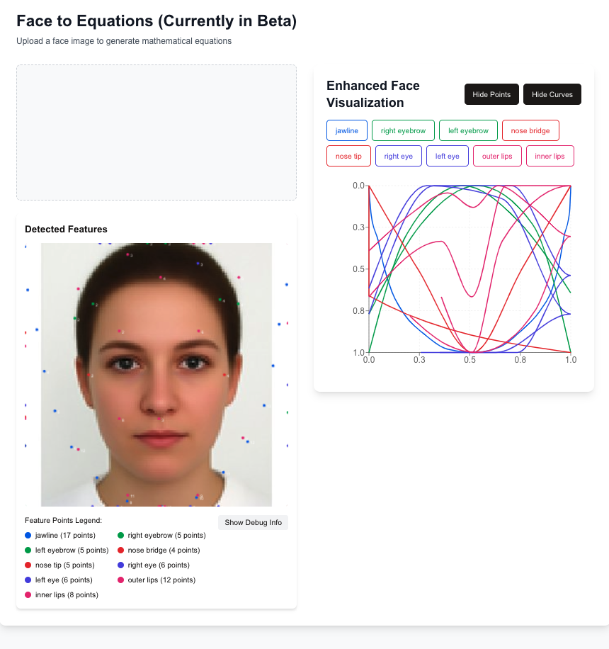

# FaceToEquation

### Concepts Utilized
- Convex hull
- Circumcircle and curvature
- Bézier curves (rational and adaptive)
- Hermite splines
- Catmull-Rom splines
- Cubic splines
- NURBS (Non-Uniform Rational B-Splines)
- Superellipse fitting
- Fourier series fitting
- Least squares optimization
- Matrix operations for curve fitting
- Polar coordinates for radial fitting
- Piecewise curve segmentation
- Bernstein polynomials
- Differential geometry for curvature
- Subdivision surfaces for smoothness

### Maybe Features
User uploads an image of their face
Simple drag & drop or file select interface
Show preview of uploaded image

System detects face and generates initial outline
Interactive preview showing:

    - Original image
    - Generated outline overlay

Customization controls:
    - Slider for outline detail level (fewer/more points)
    - Ability to adjust outline complexity
    - Option to toggle between different mathematical approaches (polynomials, trigonometric functions, etc.)

Equation Generation & Visualization

    - Display generated equations in a clean, readable format
    - Show live graph of the equations
    - Allow copying equations to clipboard
    - Basic graph controls (zoom, pan)

Technical Components
Frontend (Next.js)

Backend (Python)
Face detection (OpenCV)
Outline extraction
Equation generation
Point simplification algorithms

Feature 
    - Single face processing only
    - Basic polynomial/trigonometric equations
    - Simple graph visualization
    - Copy equations to clipboard
    - No user accounts needed
    - No data persistence

Later Features (v2+)

    - Integration with Desmos API - Save/share results
    - Multiple equation styles
    - Better curve fitting algorithms
    - More customization options